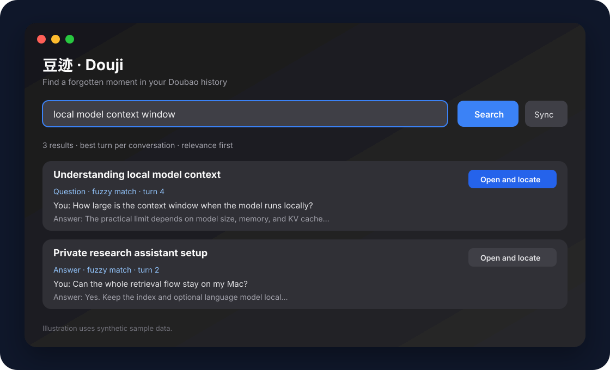

# Douji (豆迹)

<p align="center"></p>

<p align="center">A lightweight, local-first macOS companion for finding a forgotten question or answer in your Doubao conversation history — and jumping back to the exact turn.</p>

<p align="center">
  
  
  
  
</p>



## Why Douji?

Doubao can contain hundreds of useful conversations, but remembering *where* a particular idea appeared is difficult. Douji builds a private local index, searches at question-and-answer-turn level, and opens the original Doubao chat at the matching message.

Douji is intentionally small: it is a native SwiftUI app, not an Electron wrapper, and it has no server, account, analytics, or telemetry.

## Features

- **Turn-level fuzzy search** across your questions, Doubao answers, and conversation titles.
- **Advanced search** with up to six AND / OR / NOT rules, per-rule scope, and fuzzy or exact matching.
- **Open and locate**: opens the original chat, scans Doubao's virtual message list, scrolls to the matching turn or paragraph, and highlights it.
- **Guided recall**: a local `qwen3:8b` model asks narrowing questions when you only remember a vague direction.
- **Free-form refinement**: answers such as “neither of these” work; choices are not a closed questionnaire.
- **Result controls**: best turn or every turn, relevance/recent sorting, field filters, favorites, and recent searches.
- **Incremental sync** for new and recently active conversations, plus full sync.
- **Markdown export** for one question-and-answer turn and **JSON import** for offline use.

## How it works


1. `doubao-cli` reads local Doubao desktop sessions.
2. Douji normalizes conversations into question-and-answer turns.
3. The index is stored at `~/Library/Application Support/DoubaoRecall/index.json`.
4. Searches run locally in the Swift app.
5. “Open and locate” uses Doubao's local CDP endpoint to reveal the matching DOM message.
6. Guided Recall optionally sends short candidate excerpts only to a local Ollama server.

## Requirements

- macOS 14 or later
- The official Doubao desktop app, signed in
- Node.js 22 or later
- [`doubao-cli`](https://github.com/Fullstop000/doubao-cli)
- Optional: [Ollama](https://ollama.com/) with `qwen3:8b`
- Xcode Command Line Tools only when building from source

## Install for everyday use

### 1. Install the local bridge

```bash
brew install node@22
npm install --global doubao-cli
doubao --version
```

Douji also recognizes an isolated installation at `~/.local/doubao-recall`.

### 2. Install Douji

Download the latest release archive, unzip it, and drag `豆迹.app` to `/Applications`.

Development builds are ad-hoc signed. If macOS blocks the first launch, open **System Settings → Privacy & Security**, confirm that you trust this locally built app, then open it again. Never bypass a warning for a build you do not trust.

### 3. Build the local index

1. Open Doubao and keep it signed in.
2. Open Douji and click **Sync Doubao**.
3. Search for any fragment you remember.
4. Click **Open and locate**.

Future conversations are included the next time you click **Sync**. Use **Full sync** to re-read all history.

### 4. Enable Guided Recall (optional)

```bash
brew install ollama
ollama pull qwen3:8b
ollama serve
```

The model runs locally. Douji sends at most 12 short candidate excerpts to the local Ollama endpoint.

## Build from source

```bash
git clone https://github.com/VincesHu01/douji.git
cd douji
swift test --disable-sandbox
zsh scripts/build-app.sh
open "dist/豆迹.app"
```

Install the local build with:

```bash
ditto "dist/豆迹.app" "/Applications/豆迹.app"
```

The build script compiles a release binary, creates a standard macOS app bundle, embeds the icon, and applies an ad-hoc signature. It does not access your Doubao data.

## JSON import format

```json
{
  "conversations": [{
    "id": "conversation-id",
    "title": "Local search notes",
    "url": "https://www.doubao.com/chat/conversation-id",
    "updatedAt": "2026-05-12T08:30:00Z",
    "messages": [{
      "id": "message-id",
      "role": "user",
      "text": "How can I search locally without uploading my history?",
      "ordinal": 1
    }]
  }]
}
```

The importer also recognizes aliases such as `conversation_id`, `message_id`, `content`, `items`, and `sessions`.

## Privacy and security

- Conversation data stays on your Mac.
- There is no Douji cloud service, login, analytics SDK, or telemetry.
- The local index is excluded from this repository and never enters a build.
- Guided Recall is optional and talks only to `127.0.0.1:11434`.
- Douji depends on Doubao's local desktop structure and `doubao-cli`; future Doubao updates may require adapter changes.
- Review third-party dependencies before installing them.

## Current platform scope

This repository currently ships the **macOS desktop app**. iOS and Android companion access is planned, not implemented. Mobile support needs explicit local pairing and permissions so a phone never receives the complete index by default.

## Development

```bash
swift test --disable-sandbox
swift run
```

```text
Sources/DoubaoRecall/       SwiftUI app, search, sync, guided recall
Tests/DoubaoRecallTests/    Search, import, and regression tests
Resources/                 Info.plist and icon assets
fixtures/                  Synthetic sample conversations only
scripts/build-app.sh        Local app bundle build
docs/assets/                README illustrations
```

Contributions and reproducible bug reports are welcome. Do not attach real conversation exports to public issues; use synthetic text.

## License

[MIT](LICENSE). “Doubao” is a trademark of its owner. Douji is an independent community project and is not affiliated with or endorsed by Doubao or ByteDance.
