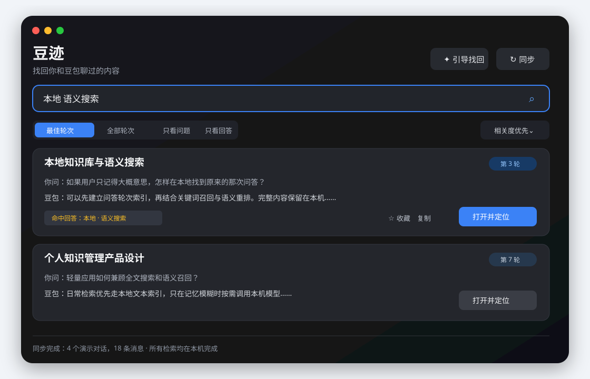
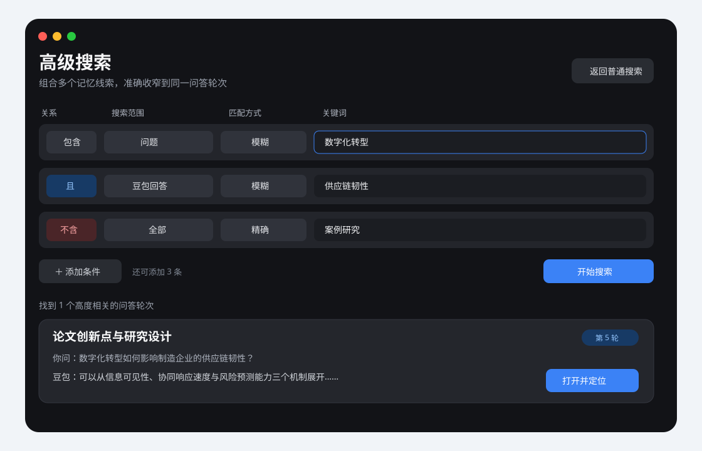
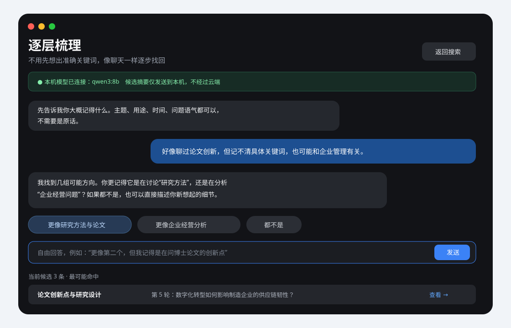
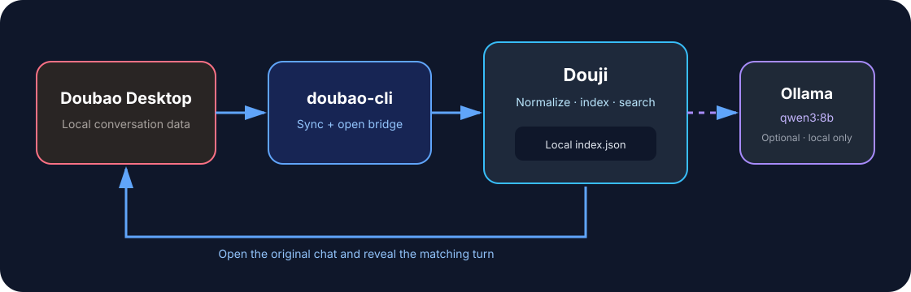

# Douji

<p align="center"></p>

<p align="center"><strong>Turn “I remember asking about this” into “this is the exact turn.”</strong></p>

<p align="center">Douji is a lightweight, privacy-first macOS companion for searching your Doubao conversation history. It builds a local index, supports fuzzy search, advanced multi-condition search, and model-assisted guided recall, then takes you back to the original conversation and attempts to reveal the exact matching question or answer.</p>

<p align="center">
  
  
  
  
</p>

> The screenshots below show the Chinese app interface with fully synthetic demonstration data. They do not contain real user conversations.

## Product tour

### 1. Direct search: recover a specific exchange from a vague memory



Enter any word, phrase, or answer fragment you still remember. Douji searches conversation titles, your questions, and Doubao's answers at the same time. Results are presented as question-and-answer turns rather than a flat list of loosely related conversations.

### 2. Advanced search: combine multiple clues



When one keyword is not enough, combine up to six AND, OR, and NOT rules. Every rule can target a different field and use fuzzy or exact matching. For example, require “digital transformation” in the question and “supply-chain resilience” in the answer while excluding “case study.”

### 3. Guided Recall: narrow down the target through conversation



If you cannot remember useful keywords, Douji can use a local `qwen3:8b` model to ask discriminating follow-up questions based on a small candidate set. You may click a suggestion or reply freely with phrases such as “neither,” “closer to the second one, but it was not a paper,” or “probably sometime last year.” Guided Recall treats those replies as new evidence instead of forcing you through a closed questionnaire.

## The problem Douji solves

Doubao is effective at producing useful answers, but recovering an older answer can be difficult:

- You may remember the idea but not the original wording.
- A broad keyword can return many weakly related conversations.
- A conversation-level match does not reveal which turn contains the useful material.
- Opening a long conversation may place you at the bottom, leaving you to scroll manually.
- Sometimes you remember only a topic, purpose, approximate date, or tone—not a searchable phrase.

Douji focuses specifically on historical knowledge retrieval:

- It converts long conversations into individual user-question and assistant-answer turns.
- It reports the matching turn and whether the evidence came from the title, question, or answer.
- It supports field-aware Boolean rules for combining incomplete clues.
- It provides an optional local conversational workflow for reconstructing a vague memory.
- It opens the original Doubao conversation and attempts to scroll to and highlight the matched content.
- Its index and search engine remain on your Mac.

## Core features

### Turn-level fuzzy search

- Search conversation titles, user questions, and Doubao answers together.
- Match Chinese text, continuous phrases, English words, and numbers.
- Switch between the best turn per conversation and every matching turn.
- See the conversation title, turn number, question excerpt, answer excerpt, and matched fragment.
- Limit results to questions or answers when you remember who said the phrase.
- Sort by relevance or recency.
- Consolidate repeated matches from the same conversation so strong results are not buried under duplicate cards.

The unit of retrieval is a conversational turn, not just a conversation. This distinction makes a result immediately understandable before you leave Douji.

### Advanced multi-condition search

Each condition has four components: a logical relationship, a field scope, a match mode, and a query.

| Setting | Purpose |
| --- | --- |
| AND | Require multiple remembered clues to appear together |
| OR | Accept any of several synonyms or uncertain phrases |
| NOT | Exclude a known irrelevant topic, project, or phrase |
| All / Question / Answer / Title | Specify where a clue is expected to appear |
| Fuzzy / Exact | Allow approximate wording or require the full phrase |

You can add up to six rules. Conditions are evaluated in the context of the same question-and-answer turn, preventing a misleading match where keyword A appears in turn 1 and keyword B appears in turn 30.

Example uses include:

- Find a question containing a research topic and an answer containing a specific method.
- Search for either of two remembered synonyms while excluding an unrelated project.
- Require an exact quotation in an answer but use a fuzzy topic match in the title.
- Restrict all evidence to your own questions when you remember asking something but not the response.

### Local model-assisted Guided Recall

Guided Recall is designed for cases where the user remembers a direction but not a query.

- Douji first produces a bounded local candidate set.
- A local Ollama model, `qwen3:8b`, examines short candidate excerpts and generates a question that helps distinguish them.
- Suggested answers provide quick choices, but the input field always accepts natural free-form replies.
- Responses such as “neither,” “I am not sure,” “it was probably earlier,” or “I remember asking it rather than reading it in the answer” become new search evidence.
- Each round can narrow, re-rank, or redirect the candidate set.
- The workflow continues until a specific question or answer can be selected.

At most 12 short candidate excerpts are sent to `127.0.0.1:11434`. The complete index is not sent to a cloud model. Ollama is optional; direct and advanced search work without it.

### Open the original conversation and reveal the matching turn

Selecting **Open and Locate** starts a multi-stage navigation process:

1. Open the corresponding original conversation in Doubao.
2. Wait for the page and its virtual message list to load.
3. Search for the target using the message identifier, turn position, and text anchors.
4. Scroll in stages and continue scanning messages that were not initially rendered.
5. Bring the target into view and briefly highlight the matched question or answer.

This goes beyond opening a conversation URL. Exact-turn navigation depends on the current structure of the Doubao desktop client. If a future Doubao update changes that structure, Douji should still open the correct conversation, but its locator adapter may need an update.

### Incremental and full synchronization

- A normal sync adds new conversations and refreshes recently changed ones.
- Incremental sync is intended for everyday use and minimizes waiting and resource consumption.
- Full sync re-reads all accessible history when an index is incomplete, Doubao has changed, or troubleshooting is required.
- The status bar reports the indexed conversation and message counts.
- New conversations are included the next time you click **Sync**; an existing index does not need to be deleted.
- JSON import supports offline testing, migration, and alternative collection workflows.

### Result management and knowledge reuse

- Favorite important turns to create a cross-conversation retrieval layer.
- Copy a matched excerpt into a document, note, or new prompt.
- Export one useful question-and-answer turn as Markdown rather than exporting an entire conversation.
- Reuse recent searches for recurring topics.
- Keep Doubao as the system of record: Douji indexes, searches, and navigates, but does not edit original conversations.

## How Douji differs from native conversation browsing

| Capability | Typical native workflow | Douji |
| --- | --- | --- |
| Retrieval unit | Primarily a conversation | A specific question or answer turn |
| Vague memory | Requires the user to invent a good keyword | A local model helps reconstruct the memory |
| Multiple clues | Limited expression of Boolean relationships | Up to six field-level AND, OR, and NOT rules |
| Result explanation | Open the conversation to judge relevance | Shows turn, matching field, and surrounding context |
| Navigation | Opening a long conversation may still require scrolling | Attempts to reveal and highlight the exact matched turn |
| Data processing | Product-managed search | Local index and local retrieval with no Douji cloud service |
| Knowledge reuse | Primarily conversation browsing | Favorites, copying, and single-turn Markdown export |

Douji is not a replacement for the Doubao client and does not generate answers. It complements Doubao by making cross-history, fine-grained, explainable retrieval substantially easier.

## How it works



1. `doubao-cli` reads locally accessible sessions from the signed-in Doubao desktop client.
2. Douji normalizes messages and organizes them into question-and-answer turns.
3. The index is stored at `~/Library/Application Support/DoubaoRecall/index.json`.
4. Direct search, advanced search, favorites, and sorting run locally inside the Swift application.
5. **Open and Locate** uses Doubao's local CDP endpoint to open the original conversation and find the target DOM message.
6. Guided Recall is optional and communicates only with the local Ollama service.

## Lightweight by design

- Native SwiftUI application rather than an Electron wrapper.
- No Douji server, account, analytics SDK, or telemetry.
- A readable local JSON index that is straightforward to inspect, back up, or migrate.
- Ordinary search never starts a language model.
- Ollama is contacted only when the user explicitly enters Guided Recall.
- Incremental sync focuses on new and recently changed conversations.
- No model weights are bundled; `qwen3:8b` is installed separately only when desired.

## Requirements

- macOS 14 or later
- The official Doubao desktop app, signed in
- Node.js 22 or later
- [`doubao-cli`](https://github.com/Fullstop000/doubao-cli)
- Optional: [Ollama](https://ollama.com/) with `qwen3:8b`
- Xcode Command Line Tools when building from source

## Installation and everyday use

### 1. Install the local bridge

```bash
brew install node@22
npm install --global doubao-cli
doubao --version
```

Douji also recognizes an isolated installation at `~/.local/doubao-recall`.

### 2. Install Douji

Download the latest archive from [Releases](https://github.com/VincesHu01/douji/releases), extract it, and drag `豆迹.app` into `/Applications`.

Development builds use an ad-hoc signature. If macOS blocks the first launch, open **System Settings → Privacy & Security**, confirm that you trust the locally built application, and launch it again. Never bypass a warning for a build you do not trust.

### 3. Build the first index

1. Open Doubao and keep it signed in.
2. Open Douji and click the Sync button in the upper-right corner.
3. Wait for the status bar to report the number of synchronized conversations and messages.
4. Enter any phrase you remember, or switch to Advanced Search or Guided Recall.
5. Select **Open and Locate** on a result.

After creating new Doubao conversations, click Sync again to include them in the existing index. A full sync is not required for normal updates.

### 4. Enable Guided Recall (optional)

```bash
brew install ollama
ollama pull qwen3:8b
ollama serve
```

If Ollama is not running, direct search and advanced search remain fully available.

## Build from source

```bash
git clone https://github.com/VincesHu01/douji.git
cd douji
swift test --disable-sandbox
zsh scripts/build-app.sh
open "dist/豆迹.app"
```

Install the local build with:

```bash
ditto "dist/豆迹.app" "/Applications/豆迹.app"
```

The build script compiles a release binary, creates a standard macOS application bundle, embeds the icon, and applies an ad-hoc signature. It does not read your Doubao conversations.

## JSON import format

```json
{
  "conversations": [{
    "id": "conversation-id",
    "title": "Local semantic search",
    "url": "https://www.doubao.com/chat/conversation-id",
    "updatedAt": "2026-05-12T08:30:00Z",
    "messages": [{
      "id": "message-id",
      "role": "user",
      "text": "How can I search locally without uploading my history?",
      "ordinal": 1
    }]
  }]
}
```

The importer also recognizes common aliases including `conversation_id`, `message_id`, `content`, `items`, and `sessions`.

## Privacy and security

- Conversation data and the search index remain on your Mac.
- There is no Douji cloud service, account system, analytics SDK, or telemetry.
- The local index is excluded from the Git repository and application build artifacts.
- Guided Recall connects only to `127.0.0.1:11434` and can remain completely disabled.
- Never attach real conversation exports to public issues; use synthetic reproduction data.
- Douji depends on the Doubao desktop structure and the third-party `doubao-cli`. Review third-party dependencies before installing them.

## Current platform scope

This repository currently ships the **macOS desktop application**. iOS and Android companion access is planned but not implemented. Any future mobile design will prioritize explicit local pairing, narrow permissions, and minimal data transfer rather than sending the complete conversation index to a phone or cloud service by default.

## Project structure

```text
Sources/DoubaoRecall/       SwiftUI interface, search, sync, and Guided Recall
Tests/DoubaoRecallTests/    Search, import, navigation, and regression tests
Resources/                 Info.plist and application icon resources
scripts/build-app.sh        Local application bundle build script
docs/assets/                Chinese interface screenshots and architecture image
```

Contributions and reproducible bug reports are welcome.

## License and trademark notice

[MIT License](LICENSE). Doubao is a trademark of its respective owner. Douji is an independent community project and is not affiliated with, authorized by, or endorsed by Doubao or ByteDance.
